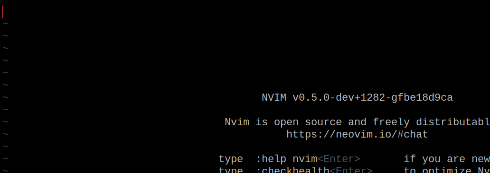

# compe-nextword
Provides intelligent English autocomplete for compe-nvim via nextword.



## Install
You also need to install [Nextword](https://github.com/high-moctane/nextword) and
[Nextword-data](https://github.com/high-moctane/nextword-data).

### Using plug:

```vim
Plug 'nvim-lua/plenary.nvim'
Plug 'hrsh7th/nvim-compe'
Plug 'Gavinok/compe-nextword'
```

### Using Packer:

```lua
return require("packer").startup(
 function(use)
 	use "hrsh7th/nvim-compe" --completion
 	use {'Gavinok/compe-nextword', requires = 'nvim-lua/plenary.nvim', requires = 'hrsh7th/nvim-compe'}
 end
)
```

## Usage 

Make sure that compe-nvim is loaded.

```vim
let g:compe.source.nextword = v:true
```

```clojure
((. (require :compe) :setup) 
 {:source 
   {:nextword true})
```

```lua
require'compe'.setup {
  source = {
      nextword = true
    }
}
```


## Acknowledgments

* Hat tip to [compe-zsh](https://github.com/tamago324/compe-zsh) and [asyncomplete-nextword.vim](https://github.com/high-moctane/asyncomplete-nextword.vim)
  whose code was used as reference

## License

MIT
